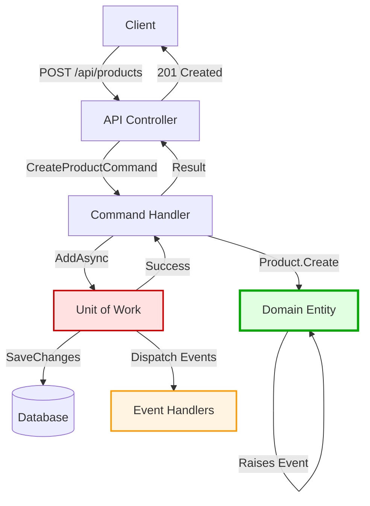
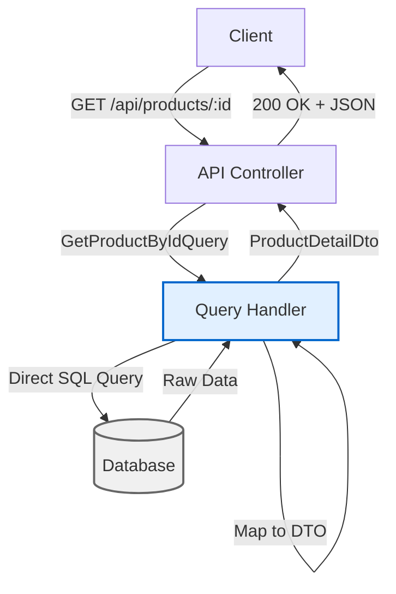

# Command/Query Flow Diagram (CQRS)

## Overview: Command Query Responsibility Segregation

CQRS separates **write operations (Commands)** from **read operations (Queries)**.

### Key Principles

- **Commands:** Change state, don't return data
- **Queries:** Return data, don't change state
- **Separation:** Different models for reads and writes

---

## Command Flow (Write Operations)

### ASCII Diagram - Creating a Product

```
┌─────────────────────────────────────────────────────────────────────────┐
│ CLIENT                                                                   │
└─────────────────────────────────────────────────────────────────────────┘
    │
    │ HTTP POST /api/products
    │ {
    │   "name": "Gaming Laptop",
    │   "sku": "LAPTOP-001",
    │   "price": 1299.99,
    │   "currency": "USD"
    │ }
    │
    ▼
┌─────────────────────────────────────────────────────────────────────────┐
│ LAYER 1: API (ProductsController)                                       │
├─────────────────────────────────────────────────────────────────────────┤
│                                                                         │
│  [HttpPost]                                                             │
│  public async Task<IActionResult> CreateProduct(                        │
│      CreateProductRequest request)                                      │
│  {                                                                      │
│      // ✅ Map HTTP request to Command                                  │
│      var command = new CreateProductCommand(                            │
│          request.Name,                                                  │
│          request.SKU,                                                   │
│          request.Price,                                                 │
│          request.Currency                                               │
│      );                                                                 │
│                                                                         │
│      // ✅ Send command via MediatR                                     │
│      var result = await _mediator.Send(command);                        │
│                                                                         │
│      // ✅ Return HTTP response                                         │
│      if (result.IsSuccess)                                              │
│          return Created($"/api/products/{result.Value}", null);         │
│      return BadRequest(result.Error);                                   │
│  }                                                                      │
│                                                                         │
└─────────────────────────────────────────────────────────────────────────┘
    │
    │ MediatR routes to handler
    │
    ▼
┌─────────────────────────────────────────────────────────────────────────┐
│ LAYER 2: APPLICATION (CreateProductCommandHandler)                      │
├─────────────────────────────────────────────────────────────────────────┤
│                                                                         │
│  public class CreateProductCommandHandler                               │
│      : IRequestHandler<CreateProductCommand, Result<Guid>>              │
│  {                                                                      │
│      private readonly IUnitOfWork _unitOfWork;                          │
│                                                                         │
│      public async Task<Result<Guid>> Handle(                            │
│          CreateProductCommand request)                                  │
│      {                                                                  │
│          // ✅ STEP 1: Validate business rules                          │
│          var existingSku = await _unitOfWork.Products                   │
│              .GetBySkuAsync(request.SKU);                               │
│          if (existingSku != null)                                       │
│              return Result.Failure("SKU already exists");               │
│                                                                         │
│          // ✅ STEP 2: Create value objects                             │
│          var sku = SKU.Create(request.SKU);                             │
│          var price = Money.Create(request.Price, request.Currency);     │
│                                                                         │
│          // ✅ STEP 3: Call domain factory                              │
│          var product = Product.Create(                                  │
│              tenantId, categoryId, name, desc,                          │
│              sku, price, images, "admin"                                │
│          );                                                             │
│          // Domain event raised: ProductCreatedEvent                    │
│                                                                         │
│          // ✅ STEP 4: Persist                                          │
│          await _unitOfWork.Products.AddAsync(product);                  │
│          await _unitOfWork.SaveChangesAsync();                          │
│          // Events dispatched automatically                             │
│                                                                         │
│          // ✅ STEP 5: Return result (ID only, not full object)         │
│          return Result.Success(product.Id);                             │
│      }                                                                  │
│  }                                                                      │
│                                                                         │
└─────────────────────────────────────────────────────────────────────────┘
    │
    │ Uses domain factory
    │
    ▼
┌─────────────────────────────────────────────────────────────────────────┐
│ LAYER 3: DOMAIN (Product.Create)                                        │
├─────────────────────────────────────────────────────────────────────────┤
│                                                                         │
│  public static Product Create(...)                                      │
│  {                                                                      │
│      // ✅ Business validation                                          │
│      ValidateName(name);                                                │
│      ArgumentNullException.ThrowIfNull(sku);                            │
│      ArgumentNullException.ThrowIfNull(price);                          │
│                                                                         │
│      // ✅ Create product                                               │
│      var product = new Product                                          │
│      {                                                                  │
│          Id = Guid.NewGuid(),                                           │
│          _name = name,                                                  │
│          _sku = sku,                                                    │
│          _price = price,                                                │
│          _status = ProductStatus.Draft                                  │
│      };                                                                 │
│                                                                         │
│      // ✅ Raise domain event                                           │
│      product.AddDomainEvent(                                            │
│          new ProductCreatedEvent(product.Id, name, sku)                 │
│      );                                                                 │
│                                                                         │
│      return product;                                                    │
│  }                                                                      │
│                                                                         │
└─────────────────────────────────────────────────────────────────────────┘
    │
    │ Persisted via Unit of Work
    │
    ▼
┌─────────────────────────────────────────────────────────────────────────┐
│ LAYER 4: INFRASTRUCTURE (UnitOfWork & Repository)                       │
├─────────────────────────────────────────────────────────────────────────┤
│                                                                         │
│  • ProductRepository.AddAsync(product)                                  │
│  • UnitOfWork.SaveChangesAsync()                                        │
│      → DispatchDomainEventsAsync()                                      │
│      → _context.SaveChangesAsync()                                      │
│                                                                         │
│  ✅ Result: Product saved to database                                   │
│  ✅ Events dispatched to handlers                                       │
│                                                                         │
└─────────────────────────────────────────────────────────────────────────┘
    │
    │ Returns success with Product ID
    │
    ▼
┌─────────────────────────────────────────────────────────────────────────┐
│ CLIENT RECEIVES                                                          │
├─────────────────────────────────────────────────────────────────────────┤
│                                                                         │
│  HTTP 201 Created                                                       │
│  Location: /api/products/12345678-1234-1234-1234-123456789012          │
│                                                                         │
│  ✅ Product created                                                      │
│  ✅ Events handled (search indexed, cache updated, etc.)                 │
│                                                                         │
└─────────────────────────────────────────────────────────────────────────┘
```

---

## Query Flow (Read Operations)

### ASCII Diagram - Getting Product by ID

```
┌─────────────────────────────────────────────────────────────────────────┐
│ CLIENT                                                                   │
└─────────────────────────────────────────────────────────────────────────┘
    │
    │ HTTP GET /api/products/12345678-1234-1234-1234-123456789012
    │
    ▼
┌─────────────────────────────────────────────────────────────────────────┐
│ LAYER 1: API (ProductsController)                                       │
├─────────────────────────────────────────────────────────────────────────┤
│                                                                         │
│  [HttpGet("{id}")]                                                      │
│  public async Task<IActionResult> GetProduct(Guid id)                   │
│  {                                                                      │
│      // ✅ Create Query (not Command!)                                  │
│      var query = new GetProductByIdQuery(id);                           │
│                                                                         │
│      // ✅ Send query via MediatR                                       │
│      var product = await _mediator.Send(query);                         │
│                                                                         │
│      // ✅ Return DTO (not domain entity!)                              │
│      if (product == null)                                               │
│          return NotFound();                                             │
│      return Ok(product);                                                │
│  }                                                                      │
│                                                                         │
└─────────────────────────────────────────────────────────────────────────┘
    │
    │ MediatR routes to handler
    │
    ▼
┌─────────────────────────────────────────────────────────────────────────┐
│ LAYER 2: APPLICATION (GetProductByIdQueryHandler)                       │
├─────────────────────────────────────────────────────────────────────────┤
│                                                                         │
│  public class GetProductByIdQueryHandler                                │
│      : IRequestHandler<GetProductByIdQuery, ProductDetailDto>           │
│  {                                                                      │
│      private readonly CatalogDbContext _context;                        │
│                                                                         │
│      public async Task<ProductDetailDto> Handle(                        │
│          GetProductByIdQuery request)                                   │
│      {                                                                  │
│          // ✅ DIRECT DATABASE QUERY (bypass domain!)                   │
│          // This is OK for reads - we don't need business logic         │
│          return await _context.Products                                 │
│              .Where(p => p.Id == request.Id)                            │
│              .Select(p => new ProductDetailDto                          │
│              {                                                          │
│                  Id = p.Id,                                             │
│                  Name = p.Name,                                         │
│                  Description = p.Description,                           │
│                  SKU = p.SKU.Value,  // Value object unwrapped          │
│                  Price = p.Price.Amount,                                │
│                  Currency = p.Price.Currency,                           │
│                  CompareAtPrice = p.CompareAtPrice.Amount,              │
│                  Images = p.Images.Urls.ToList(),                       │
│                  Status = p.Status.ToString(),                          │
│                  CategoryName = p.Category.Name,  // Joined!            │
│                  InStock = p.StockQuantity > 0                          │
│              })                                                         │
│              .FirstOrDefaultAsync();                                    │
│          // ✅ Returns DTO optimized for this view                      │
│          // ✅ NO domain entities used                                  │
│          // ✅ NO business logic executed                               │
│      }                                                                  │
│  }                                                                      │
│                                                                         │
└─────────────────────────────────────────────────────────────────────────┘
    │
    │ Direct database query (EF Core)
    │
    ▼
┌─────────────────────────────────────────────────────────────────────────┐
│ LAYER 4: INFRASTRUCTURE (Database)                                      │
├─────────────────────────────────────────────────────────────────────────┤
│                                                                         │
│  SQL Generated by EF Core:                                              │
│                                                                         │
│  SELECT                                                                 │
│      p.Id, p.Name, p.Description,                                       │
│      p.SKU, p.Price, p.Currency,                                        │
│      p.CompareAtPrice, p.Images,                                        │
│      c.Name AS CategoryName                                             │
│  FROM Products p                                                        │
│  LEFT JOIN Categories c ON p.CategoryId = c.Id                          │
│  WHERE p.Id = @id                                                       │
│                                                                         │
│  ✅ Efficient - only queries needed columns                             │
│  ✅ Joins performed in database                                         │
│  ✅ No domain model loaded                                              │
│                                                                         │
└─────────────────────────────────────────────────────────────────────────┘
    │
    │ Returns DTO
    │
    ▼
┌─────────────────────────────────────────────────────────────────────────┐
│ CLIENT RECEIVES                                                          │
├─────────────────────────────────────────────────────────────────────────┤
│                                                                         │
│  HTTP 200 OK                                                            │
│  {                                                                      │
│    "id": "12345678-1234-1234-1234-123456789012",                        │
│    "name": "Gaming Laptop",                                             │
│    "description": "High-performance gaming laptop",                     │
│    "sku": "LAPTOP-001",                                                 │
│    "price": 1299.99,                                                    │
│    "currency": "USD",                                                   │
│    "compareAtPrice": 1499.99,                                           │
│    "images": ["url1", "url2"],                                          │
│    "status": "Active",                                                  │
│    "categoryName": "Electronics",                                       │
│    "inStock": true                                                      │
│  }                                                                      │
│                                                                         │
└─────────────────────────────────────────────────────────────────────────┘
```

---

## Side-by-Side Comparison

### Commands vs Queries

```
┌─────────────────────────────────────────────────────────────────────────┐
│                           COMMANDS (Write)                              │
├─────────────────────────────────────────────────────────────────────────┤
│                                                                         │
│  Purpose: CHANGE STATE                                                  │
│                                                                         │
│  Flow:                                                                  │
│  API → Command → Handler → Domain Entities → UnitOfWork → Database     │
│                                                                         │
│  Uses:                                                                  │
│  ✅ Domain entities (Product.Create, product.ChangePrice)               │
│  ✅ Value objects (Money, SKU)                                          │
│  ✅ Business methods                                                    │
│  ✅ Domain events                                                       │
│  ✅ Unit of Work                                                        │
│                                                                         │
│  Returns:                                                               │
│  ✅ Result<Guid> (success/failure + ID)                                 │
│  ❌ NOT full object                                                     │
│                                                                         │
│  Example Commands:                                                      │
│  • CreateProductCommand                                                 │
│  • UpdateProductCommand                                                 │
│  • DeleteProductCommand                                                 │
│  • PublishProductCommand                                                │
│                                                                         │
└─────────────────────────────────────────────────────────────────────────┘

┌─────────────────────────────────────────────────────────────────────────┐
│                           QUERIES (Read)                                │
├─────────────────────────────────────────────────────────────────────────┤
│                                                                         │
│  Purpose: GET DATA                                                      │
│                                                                         │
│  Flow:                                                                  │
│  API → Query → Handler → Direct DB Query → DTO                         │
│                                                                         │
│  Uses:                                                                  │
│  ✅ DbContext directly (bypass domain!)                                 │
│  ✅ LINQ projections                                                    │
│  ✅ Database joins                                                      │
│  ✅ DTOs optimized for view                                             │
│                                                                         │
│  Does NOT use:                                                          │
│  ❌ Domain entities                                                     │
│  ❌ Business methods                                                    │
│  ❌ Domain events                                                       │
│  ❌ Unit of Work                                                        │
│                                                                         │
│  Returns:                                                               │
│  ✅ DTO (ProductDetailDto, ProductListItemDto)                          │
│                                                                         │
│  Example Queries:                                                       │
│  • GetProductByIdQuery                                                  │
│  • GetProductsQuery (list with filters)                                 │
│  • GetProductsByCategory Query                                          │
│  • SearchProductsQuery                                                  │
│                                                                         │
└─────────────────────────────────────────────────────────────────────────┘
```

---

## Key Differences

### What Makes Them Different?

| Aspect | Command | Query |
|--------|---------|-------|
| **Purpose** | Change state | Retrieve data |
| **Returns** | Result (success/error) | DTO with data |
| **Uses Domain** | ✅ Yes (entities, business logic) | ❌ No (direct DB query) |
| **Events** | ✅ Raises domain events | ❌ No events |
| **Transaction** | ✅ Via Unit of Work | ❌ Read-only |
| **Validation** | ✅ Business rules enforced | ❌ Minimal (format only) |
| **Performance** | Slower (business logic) | Faster (direct query) |
| **Complexity** | Higher (business logic) | Lower (just data) |

---

## Code Examples

### Command: Update Price

```csharp
// ═══════════════════════════════════════════════════════════
// COMMAND
// ═══════════════════════════════════════════════════════════

public record UpdateProductPriceCommand(
    Guid ProductId,
    decimal NewPrice,
    string UpdatedBy
) : IRequest<Result>;

public class UpdateProductPriceCommandHandler
    : IRequestHandler<UpdateProductPriceCommand, Result>
{
    private readonly IUnitOfWork _unitOfWork;

    public async Task<Result> Handle(UpdateProductPriceCommand request)
    {
        // ✅ Load domain entity
        var product = await _unitOfWork.Products.GetByIdAsync(request.ProductId);
        if (product == null)
            return Result.Failure("Product not found");

        // ✅ Create value object
        var newPrice = Money.Create(request.NewPrice);
        if (newPrice == null)
            return Result.Failure("Invalid price");

        // ✅ Call business method (domain logic!)
        product.ChangePrice(newPrice, request.UpdatedBy);
        // → Validates business rules
        // → Raises ProductPriceChangedEvent
        // → Updates audit fields

        // ✅ Save via Unit of Work
        await _unitOfWork.SaveChangesAsync();
        // → Dispatches events
        // → Saves to database

        // ✅ Return result (no data!)
        return Result.Success();
    }
}
```

### Query: Get Products List

```csharp
// ═══════════════════════════════════════════════════════════
// QUERY
// ═══════════════════════════════════════════════════════════

public record GetProductsQuery(
    int Page = 1,
    int PageSize = 20,
    string? SearchTerm = null,
    Guid? CategoryId = null
) : IRequest<PagedResult<ProductListItemDto>>;

public class GetProductsQueryHandler
    : IRequestHandler<GetProductsQuery, PagedResult<ProductListItemDto>>
{
    private readonly CatalogDbContext _context;

    public async Task<PagedResult<ProductListItemDto>> Handle(
        GetProductsQuery request)
    {
        // ✅ Direct database query (bypass domain!)
        var query = _context.Products.AsQueryable();

        // ✅ Apply filters
        if (!string.IsNullOrEmpty(request.SearchTerm))
            query = query.Where(p => p.Name.Contains(request.SearchTerm));

        if (request.CategoryId.HasValue)
            query = query.Where(p => p.CategoryId == request.CategoryId);

        // ✅ Project to DTO (optimized for this view)
        var items = await query
            .OrderBy(p => p.Name)
            .Skip((request.Page - 1) * request.PageSize)
            .Take(request.PageSize)
            .Select(p => new ProductListItemDto
            {
                Id = p.Id,
                Name = p.Name,
                Price = p.Price.Amount,
                ImageUrl = p.Images.Urls.FirstOrDefault(),
                InStock = p.StockQuantity > 0
            })
            .ToListAsync();

        var totalCount = await query.CountAsync();

        // ✅ Return data
        return new PagedResult<ProductListItemDto>(items, totalCount);
    }
}
```

---

## Mermaid Diagrams

### Command Flow



### Query Flow



---

## Benefits of CQRS

### 1. Optimized Reads

```csharp
// ✅ QUERY: Optimized for display
// Only selects needed columns, no business logic overhead
return await _context.Products
    .Where(p => p.Status == ProductStatus.Active)
    .Select(p => new ProductListItemDto
    {
        Id = p.Id,
        Name = p.Name,
        Price = p.Price.Amount,
        ImageUrl = p.Images.Urls.First()  // Just first image
    })
    .ToListAsync();

// Fast! No domain model loading, no business logic
```

### 2. Simplified Writes

```csharp
// ✅ COMMAND: Uses full domain model
// Business logic, validation, events - all enforced
var product = await _unitOfWork.Products.GetByIdAsync(id);
product.Publish("admin");  // Business method with rules
await _unitOfWork.SaveChangesAsync();

// Correct! Domain logic always applied
```

### 3. Different Models

```csharp
// ✅ Write Model: Domain entities
public class Product  // Full domain model
{
    public void ChangePrice(Money newPrice) { /* business logic */ }
    public void Publish() { /* business logic */ }
}

// ✅ Read Model: DTOs optimized for views
public class ProductListItemDto  // Simple DTO
{
    public Guid Id { get; set; }
    public string Name { get; set; }
    public decimal Price { get; set; }
}

public class ProductDetailDto  // Different DTO for detail view
{
    public Guid Id { get; set; }
    public string Name { get; set; }
    public string Description { get; set; }
    public decimal Price { get; set; }
    public List<string> Images { get; set; }
    public string CategoryName { get; set; }
}
// Each view gets its own optimized DTO!
```

### 4. Scalability

```
Commands (Writes):
- Less frequent
- Can be queued
- Eventual consistency OK

Queries (Reads):
- More frequent (90%+ of requests)
- Can be cached
- Can use read replicas
- Can be denormalized
```

---

## Key Takeaways

1. **Commands Change State** - Use domain model, business logic, events
2. **Queries Get Data** - Direct DB queries, DTOs, optimized for view
3. **Separation of Concerns** - Different models for reads and writes
4. **Performance** - Queries are faster (no business logic overhead)
5. **Correctness** - Commands always enforce business rules
6. **Flexibility** - Can optimize reads and writes independently

---

## Further Reading

- `/docs/DDD-PATTERNS-CATALOG.md` - CQRS section
- `/docs/examples/CompleteFlow_CreateProduct.cs` - Full command example
- `/src/Application/Products/Commands/` - All command handlers
- `/src/Application/Products/Queries/` - All query handlers
