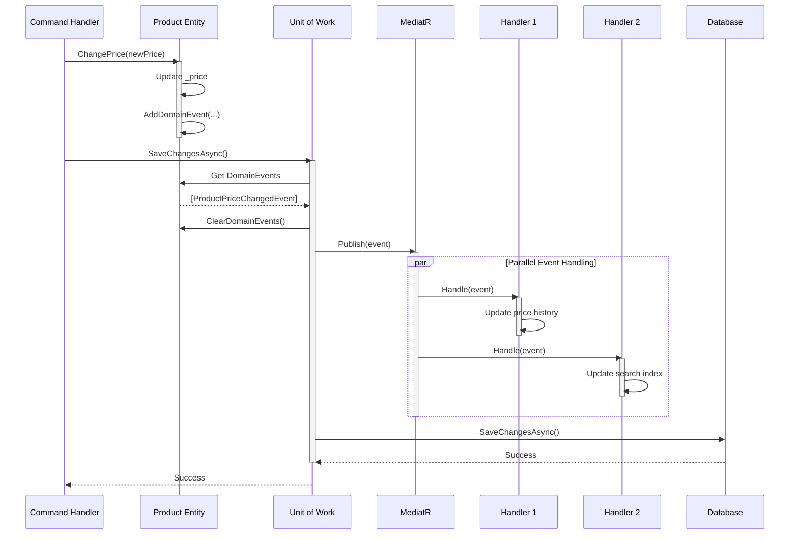

# Domain Event Flow Diagram

## Overview: How Domain Events Work

Domain events enable **loosely-coupled reactions** to business events without tight dependencies.

### Key Concepts

1. **Raise Event** - Domain entity raises event when something significant happens
2. **Collect Events** - Events collected in entity until save
3. **Dispatch Events** - Unit of Work dispatches events before save
4. **Handle Events** - Event handlers react (side effects)

---

## Complete Event Flow

### ASCII Diagram

```
┌─────────────────────────────────────────────────────────────────────────┐
│ STEP 1: Domain Entity Raises Event                                      │
└─────────────────────────────────────────────────────────────────────────┘

    Application Layer (Command Handler)
    │
    │  var product = await _unitOfWork.Products.GetByIdAsync(id);
    │  product.ChangePrice(newPrice, "admin");  ◄── Calls business method
    │
    └──────────────┬───────────────────────────
                   │
                   ▼
            Domain Layer (Product Entity)
            ┌──────────────────────────────────────────────┐
            │ public void ChangePrice(Money newPrice, ...) │
            │ {                                            │
            │     _price = newPrice;                       │
            │     UpdateAudit(updatedBy);                  │
            │                                              │
            │     // ✅ RAISE DOMAIN EVENT                 │
            │     AddDomainEvent(                          │
            │         new ProductPriceChangedEvent(        │
            │             Id,                              │
            │             oldPrice,                        │
            │             newPrice                         │
            │         )                                    │
            │     );                                       │
            │ }                                            │
            └──────────────────────────────────────────────┘
                   │
                   │ Event stored in entity's
                   │ _domainEvents collection
                   ▼
            ┌──────────────────────────────────┐
            │ Product._domainEvents:           │
            │ [                                │
            │   ProductPriceChangedEvent {     │
            │     ProductId: guid,             │
            │     OldPrice: 79.99,             │
            │     NewPrice: 99.99              │
            │   }                              │
            │ ]                                │
            └──────────────────────────────────┘

┌─────────────────────────────────────────────────────────────────────────┐
│ STEP 2: Application Layer Saves                                         │
└─────────────────────────────────────────────────────────────────────────┘

    Application Layer
    │
    │  // No mention of events - automatic!
    │  await _unitOfWork.SaveChangesAsync();  ◄── Single save call
    │
    └──────────────┬───────────────────────────
                   │
                   ▼

┌─────────────────────────────────────────────────────────────────────────┐
│ STEP 3: Unit of Work Dispatches Events (BEFORE Database Save)           │
└─────────────────────────────────────────────────────────────────────────┘

    Infrastructure Layer (UnitOfWork)
    ┌────────────────────────────────────────────────────┐
    │ public async Task SaveChangesAsync()               │
    │ {                                                  │
    │     // ✅ STEP 3A: Dispatch events FIRST           │
    │     await DispatchDomainEventsAsync();             │
    │                                                    │
    │     // ✅ STEP 3B: Save to database SECOND         │
    │     return await _context.SaveChangesAsync();      │
    │ }                                                  │
    └────────────────────────────────────────────────────┘
                   │
                   │ Dispatches events
                   ▼
    ┌────────────────────────────────────────────────────┐
    │ private async Task DispatchDomainEventsAsync()     │
    │ {                                                  │
    │     // 1. Get all entities with events             │
    │     var entities = _context.ChangeTracker          │
    │         .Entries<Product>()                        │
    │         .Select(e => e.Entity)                     │
    │         .Where(e => e.DomainEvents.Any());         │
    │                                                    │
    │     // 2. Get all events                           │
    │     var events = entities                          │
    │         .SelectMany(e => e.DomainEvents);          │
    │                                                    │
    │     // 3. Clear events from entities               │
    │     entities.ForEach(e => e.ClearDomainEvents());  │
    │                                                    │
    │     // 4. Publish via MediatR                      │
    │     foreach (var evt in events)                    │
    │         await _mediator.Publish(evt);              │
    │ }                                                  │
    └────────────────────────────────────────────────────┘
                   │
                   │ MediatR publishes to handlers
                   ▼

┌─────────────────────────────────────────────────────────────────────────┐
│ STEP 4: Event Handlers React (Side Effects)                             │
└─────────────────────────────────────────────────────────────────────────┘

         MediatR finds all handlers for ProductPriceChangedEvent
                   │
        ┌──────────┴──────────┬──────────────┬───────────────┐
        │                     │              │               │
        ▼                     ▼              ▼               ▼
    Handler 1:            Handler 2:    Handler 3:      Handler 4:
    Update Price          Update         Invalidate    Send
    History               Search Index   Cache         Notification

    ┌──────────────┐  ┌──────────────┐  ┌──────────┐  ┌──────────┐
    │ class        │  │ class        │  │ class    │  │ class    │
    │ PriceHistory │  │ SearchIndex  │  │ Cache    │  │ Email    │
    │ Handler      │  │ UpdateHandler│  │ Handler  │  │ Handler  │
    ├──────────────┤  ├──────────────┤  ├──────────┤  ├──────────┤
    │              │  │              │  │          │  │          │
    │ Handle(evt)  │  │ Handle(evt)  │  │Handle    │  │Handle    │
    │ {            │  │ {            │  │(evt) {   │  │(evt) {   │
    │   await      │  │   await      │  │  await   │  │  await   │
    │   _history   │  │   _search    │  │  _cache  │  │  _email  │
    │   .Record    │  │   .Update    │  │  .Clear  │  │  .Send   │
    │   PriceChange│  │   Product    │  │  (id);   │  │  (id);   │
    │   (...);     │  │   (...);     │  │}         │  │}         │
    │ }            │  │ }            │  │          │  │          │
    └──────────────┘  └──────────────┘  └──────────┘  └──────────┘

    ✅ All handlers execute
    ✅ Decoupled from main logic
    ✅ Easy to add new handlers (no code changes to Product or Handler)
```

---

## Detailed Example: Product Price Change

### Code Flow

```csharp
// ═══════════════════════════════════════════════════════════
// STEP 1: Command Handler (Application Layer)
// ═══════════════════════════════════════════════════════════

public class UpdateProductPriceCommandHandler
{
    private readonly IUnitOfWork _unitOfWork;

    public async Task<Result> Handle(UpdateProductPriceCommand request)
    {
        // Load product
        var product = await _unitOfWork.Products.GetByIdAsync(request.Id);

        // Create value object
        var newPrice = Money.Create(request.NewPrice);

        // ✅ Call domain method - event raised HERE
        product.ChangePrice(newPrice, request.UpdatedBy);

        // ✅ Save - events dispatched automatically
        await _unitOfWork.SaveChangesAsync();

        return Result.Success();
    }
}

// ═══════════════════════════════════════════════════════════
// STEP 2: Domain Entity (Domain Layer)
// ═══════════════════════════════════════════════════════════

public class Product : BaseEntity
{
    private Money _price;
    private readonly List<IDomainEvent> _domainEvents = new();

    public void ChangePrice(Money newPrice, string updatedBy)
    {
        var oldPrice = _price;
        _price = newPrice;
        UpdateAudit(updatedBy);

        // ✅ RAISE EVENT - stored in collection
        AddDomainEvent(new ProductPriceChangedEvent(
            ProductId: Id,
            OldPrice: oldPrice.Amount,
            NewPrice: newPrice.Amount
        ));
    }

    private void AddDomainEvent(IDomainEvent domainEvent)
    {
        _domainEvents.Add(domainEvent);
    }

    public void ClearDomainEvents() => _domainEvents.Clear();
}

// ═══════════════════════════════════════════════════════════
// STEP 3: Unit of Work (Infrastructure Layer)
// ═══════════════════════════════════════════════════════════

public class UnitOfWork : IUnitOfWork
{
    private readonly CatalogDbContext _context;
    private readonly IMediator _mediator;

    public async Task<int> SaveChangesAsync(CancellationToken ct = default)
    {
        // ✅ DISPATCH EVENTS BEFORE SAVE
        await DispatchDomainEventsAsync(ct);

        // ✅ SAVE TO DATABASE
        return await _context.SaveChangesAsync(ct);
    }

    private async Task DispatchDomainEventsAsync(CancellationToken ct)
    {
        // Get all entities with events
        var entitiesWithEvents = _context.ChangeTracker
            .Entries<Product>()
            .Select(e => e.Entity)
            .Where(e => e.DomainEvents.Any())
            .ToList();

        // Get all events
        var domainEvents = entitiesWithEvents
            .SelectMany(e => e.DomainEvents)
            .ToList();

        // Clear events from entities
        entitiesWithEvents.ForEach(e => e.ClearDomainEvents());

        // ✅ PUBLISH EVENTS via MediatR
        foreach (var domainEvent in domainEvents)
        {
            await _mediator.Publish(domainEvent, ct);
        }
    }
}

// ═══════════════════════════════════════════════════════════
// STEP 4: Event Handlers (Application/Infrastructure Layer)
// ═══════════════════════════════════════════════════════════

// Handler 1: Update price history
public class ProductPriceChangedHandler_History
    : INotificationHandler<ProductPriceChangedEvent>
{
    private readonly IPriceHistoryService _priceHistory;

    public async Task Handle(ProductPriceChangedEvent evt, CancellationToken ct)
    {
        await _priceHistory.RecordPriceChange(
            evt.ProductId,
            evt.OldPrice,
            evt.NewPrice,
            DateTime.UtcNow
        );
    }
}

// Handler 2: Update search index
public class ProductPriceChangedHandler_Search
    : INotificationHandler<ProductPriceChangedEvent>
{
    private readonly ISearchIndexer _searchIndexer;

    public async Task Handle(ProductPriceChangedEvent evt, CancellationToken ct)
    {
        await _searchIndexer.UpdateProductPrice(
            evt.ProductId,
            evt.NewPrice
        );
    }
}

// Handler 3: Invalidate cache
public class ProductPriceChangedHandler_Cache
    : INotificationHandler<ProductPriceChangedEvent>
{
    private readonly ICacheService _cache;

    public async Task Handle(ProductPriceChangedEvent evt, CancellationToken ct)
    {
        await _cache.InvalidateProduct(evt.ProductId);
    }
}

// ✅ Easy to add new handler - just create class, no changes to existing code!
```

---

## Event Timeline

### Sequence Diagram (ASCII)

```
 Command      Product       UnitOfWork     MediatR      Handler1    Handler2    Handler3
 Handler      Entity                                    (History)   (Search)    (Cache)
    │            │              │            │              │           │           │
    │────┐       │              │            │              │           │           │
    │    │ Load  │              │            │              │           │           │
    │◄───┘       │              │            │              │           │           │
    │            │              │            │              │           │           │
    │──ChangePrice()──►         │            │              │           │           │
    │            │              │            │              │           │           │
    │            │──┐           │            │              │           │           │
    │            │  │ Raise     │            │              │           │           │
    │            │  │ Event     │            │              │           │           │
    │            │◄─┘           │            │              │           │           │
    │            │              │            │              │           │           │
    │──SaveChangesAsync()───────►           │              │           │           │
    │            │              │            │              │           │           │
    │            │              │──┐         │              │           │           │
    │            │              │  │ Get     │              │           │           │
    │            │              │  │ Events  │              │           │           │
    │            │              │◄─┘         │              │           │           │
    │            │              │            │              │           │           │
    │            │◄─ClearEvents─┤            │              │           │           │
    │            │              │            │              │           │           │
    │            │              │──Publish(event)──►        │           │           │
    │            │              │            │              │           │           │
    │            │              │            │──Handle()────►           │           │
    │            │              │            │◄─────────────┘           │           │
    │            │              │            │                          │           │
    │            │              │            │──Handle()────────────────►           │
    │            │              │            │◄─────────────────────────┘           │
    │            │              │            │                                      │
    │            │              │            │──Handle()────────────────────────────►
    │            │              │            │◄─────────────────────────────────────┘
    │            │              │            │              │           │           │
    │            │              │──SaveToDatabase()         │           │           │
    │            │              │◄───────────┘              │           │           │
    │            │              │            │              │           │           │
    │◄────Success────────────────            │              │           │           │
    │            │              │            │              │           │           │
```

---

## Event Types in Catalog Service

### All Domain Events

| Event | When Raised | Common Handlers |
|-------|------------|-----------------|
| **ProductCreatedEvent** | Product.Create() called | Index in search, Initialize analytics, Send welcome notification |
| **ProductPriceChangedEvent** | Product.ChangePrice() called | Record history, Update search, Clear cache, Notify subscribers |
| **ProductStockChangedEvent** | Product.UpdateStock() called | Update availability, Alert if low, Update analytics |
| **ProductPublishedEvent** | Product.Publish() called | Index in search, Send to marketing, Update catalog |
| **CategoryCreatedEvent** | Category.Create() called | Update navigation, Clear cache, Initialize metrics |

---

## Benefits of Domain Events

### 1. Decoupling

```csharp
// ❌ WITHOUT EVENTS: Tight coupling
public void ChangePrice(Money newPrice)
{
    _price = newPrice;

    // Tightly coupled to infrastructure!
    _priceHistory.Record(Id, newPrice);  // What if we remove this service?
    _searchIndexer.Update(Id);           // What if search changes?
    _cache.Invalidate(Id);               // What if we change caching?
}

// ✅ WITH EVENTS: Loose coupling
public void ChangePrice(Money newPrice)
{
    _price = newPrice;

    // Just raise event - don't know who handles it!
    AddDomainEvent(new ProductPriceChangedEvent(Id, _price));
}
// Handlers can be added/removed without changing Product!
```

### 2. Easy to Add Reactions

```csharp
// ✅ Want to send email when price changes?
// Just add a new handler - no changes to Product class!

public class ProductPriceChangedHandler_Email
    : INotificationHandler<ProductPriceChangedEvent>
{
    public async Task Handle(ProductPriceChangedEvent evt)
    {
        // Send email to subscribers
        await _emailService.NotifyPriceChange(evt.ProductId, evt.NewPrice);
    }
}
// That's it! No modifications to existing code!
```

### 3. Testability

```csharp
// ✅ Can test domain logic without infrastructure
[Fact]
public void ChangePrice_ShouldRaiseEvent()
{
    // Arrange
    var product = Product.Create(...);

    // Act
    product.ChangePrice(Money.Create(99.99m));

    // Assert - no database, no email service, just check event
    product.DomainEvents.Should().Contain(e =>
        e is ProductPriceChangedEvent evt && evt.NewPrice == 99.99m
    );
}
```

### 4. Audit Trail

```csharp
// ✅ Events provide natural audit trail
// Every significant business event is captured
// Can be logged, stored, or replayed

public class EventAuditHandler : INotificationHandler<IDomainEvent>
{
    public async Task Handle(IDomainEvent evt)
    {
        await _auditLog.Record(new AuditEntry
        {
            EventType = evt.GetType().Name,
            Timestamp = DateTime.UtcNow,
            Data = JsonSerializer.Serialize(evt)
        });
    }
}
```

---

## Mermaid Diagram - Event Flow



---

## Key Takeaways

1. **Events Raised in Domain** - Business logic raises events
2. **Events Collected** - Stored in entity until save
3. **Events Dispatched Before Save** - Unit of Work handles this
4. **Handlers React** - Multiple handlers can process same event
5. **Loose Coupling** - Domain doesn't know about handlers
6. **Easy to Extend** - Add handlers without modifying existing code

---

## Further Reading

- `/docs/DDD-PATTERNS-CATALOG.md` - Section 4: Domain Events
- `/docs/DDD-ANTI-PATTERNS-AVOIDED.md` - Anti-pattern 4 (Missing Events)
- `/src/Infrastructure/Persistence/UnitOfWork.cs` - Event dispatching code
- `/src/Domain/Events/` - All domain events
