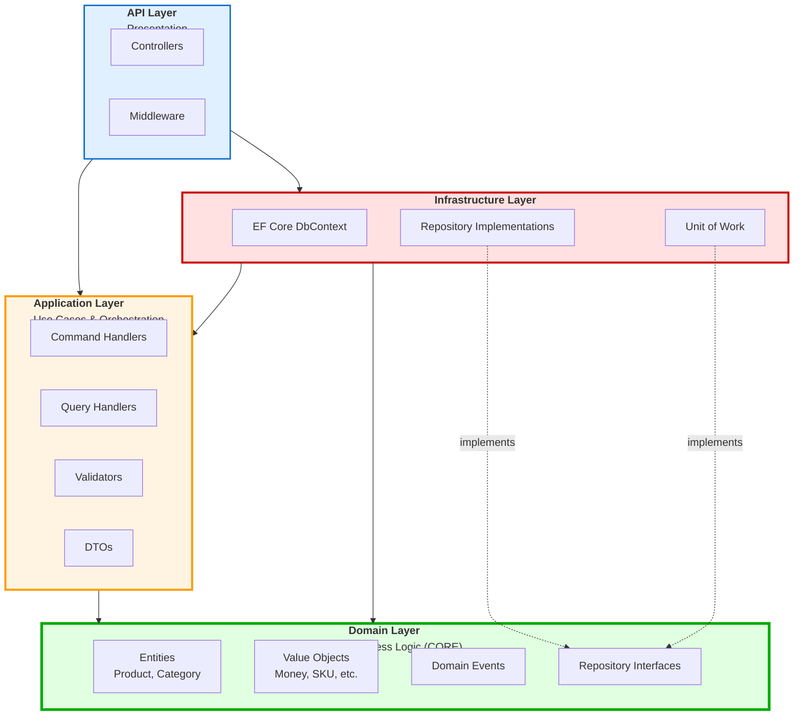

# Layer Dependencies Diagram

## Onion Architecture - Dependency Direction

### ASCII Diagram

```
                                 ┌─────────────────────┐
                                 │                     │
                          ┌──────┤   API / Web Layer   ├──────┐
                          │      │                     │      │
                          │      │ • Controllers       │      │
                          │      │ • Middleware        │      │
                          │      │ • Filters           │      │
                          │      │ • HTTP Concerns     │      │
                          │      └─────────────────────┘      │
                          │               │                   │
                          ▼               ▼                   ▼
               ┌──────────────────────────────────────────────────┐
               │                                                  │
               │         Infrastructure Layer                     │
               │                                                  │
               │  • EF Core DbContext                             │
               │  • Repository Implementations                    │
               │  • Unit of Work Implementation                   │
               │  • External Service Clients                      │
               │  • Event Dispatching                             │
               │  • Configuration                                 │
               └──────────────────────────────────────────────────┘
                          │               │                   │
                          │               ▼                   │
                          │      ┌─────────────────────┐      │
                          │      │                     │      │
                          └─────►│ Application Layer   ├──────┘
                                 │                     │
                                 │ • Commands/Queries  │
                                 │ • Handlers          │
                                 │ • DTOs              │
                                 │ • Validators        │
                                 │ • Use Cases         │
                                 │ • Orchestration     │
                                 └─────────────────────┘
                                           │
                                           ▼
                                 ┌─────────────────────┐
                                 │                     │
                                 │   Domain Layer      │
                                 │     (CORE)          │
                                 │                     │
                                 │ • Entities          │
                                 │ • Value Objects     │
                                 │ • Domain Events     │
                                 │ • Interfaces        │
                                 │ • Business Logic    │
                                 │                     │
                                 │ NO DEPENDENCIES!    │
                                 └─────────────────────┘

        Legend:
        ─────►  Depends On (Reference)
        ═════►  Implements (Dependency Inversion)
```

---

## Detailed Layer Diagram

### ASCII Diagram with Details

```
┌────────────────────────────────────────────────────────────────────────┐
│ LAYER 4: API / Presentation                                            │
│ Dependencies: → Application, → Infrastructure                          │
├────────────────────────────────────────────────────────────────────────┤
│                                                                        │
│  Controllers/                                                          │
│  ├── ProductsController.cs                                             │
│  │   └── Uses: IMediator (MediatR)                                     │
│  │   └── Returns: ActionResult<ProductDto>                             │
│  │                                                                      │
│  Middleware/                                                           │
│  ├── ExceptionHandlingMiddleware.cs                                    │
│  ├── TenantResolutionMiddleware.cs                                     │
│  │                                                                      │
│  Program.cs                                                            │
│  └── Registers all services                                            │
│  └── Configures HTTP pipeline                                          │
│                                                                        │
└────────────────────────────────────────────────────────────────────────┘
                                   ││
                                   ││ Depends On
                                   ▼▼
┌────────────────────────────────────────────────────────────────────────┐
│ LAYER 3: Infrastructure                                                │
│ Dependencies: → Application, → Domain                                  │
├────────────────────────────────────────────────────────────────────────┤
│                                                                        │
│  Persistence/                                                          │
│  ├── CatalogDbContext.cs                                               │
│  │   └── DbSet<Product>                                                │
│  │   └── DbSet<Category>                                               │
│  │                                                                      │
│  ├── Configurations/                                                   │
│  │   ├── ProductConfiguration.cs ◄── Maps domain to database          │
│  │   │   └── Configure Entity<Product>                                 │
│  │   │   └── OwnsOne for Value Objects                                 │
│  │   └── CategoryConfiguration.cs                                      │
│  │                                                                      │
│  ├── Repositories/                                                     │
│  │   ├── ProductRepository.cs ◄── Implements IProductRepository       │
│  │   └── CategoryRepository.cs ◄── Implements ICategoryRepository     │
│  │                                                                      │
│  └── UnitOfWork.cs ◄── Implements IUnitOfWork                          │
│      └── DispatchDomainEventsAsync()                                   │
│      └── SaveChangesAsync()                                            │
│                                                                        │
│  DependencyInjection.cs                                                │
│  └── Registers DbContext, Repositories, UnitOfWork                     │
│                                                                        │
└────────────────────────────────────────────────────────────────────────┘
                                   ││
                                   ││ Depends On
                                   ▼▼
┌────────────────────────────────────────────────────────────────────────┐
│ LAYER 2: Application                                                   │
│ Dependencies: → Domain ONLY                                            │
├────────────────────────────────────────────────────────────────────────┤
│                                                                        │
│  Products/                                                             │
│  ├── Commands/                                                         │
│  │   ├── CreateProduct/                                                │
│  │   │   ├── CreateProductCommand.cs ◄── Request                       │
│  │   │   ├── CreateProductCommandHandler.cs ◄── Orchestration          │
│  │   │   │   └── Uses: IUnitOfWork                                     │
│  │   │   │   └── Calls: Product.Create()                               │
│  │   │   └── CreateProductCommandValidator.cs                          │
│  │   │                                                                  │
│  │   ├── UpdateProduct/                                                │
│  │   └── DeleteProduct/                                                │
│  │                                                                      │
│  ├── Queries/                                                          │
│  │   ├── GetProductById/                                               │
│  │   │   ├── GetProductByIdQuery.cs                                    │
│  │   │   └── GetProductByIdQueryHandler.cs                             │
│  │   │                                                                  │
│  │   └── GetProducts/                                                  │
│  │                                                                      │
│  └── DTOs/                                                             │
│      ├── ProductDto.cs ◄── For queries                                 │
│      └── ProductListItemDto.cs                                         │
│                                                                        │
│  Categories/                                                           │
│  ├── Commands/                                                         │
│  ├── Queries/                                                          │
│  └── DTOs/                                                             │
│                                                                        │
└────────────────────────────────────────────────────────────────────────┘
                                   ││
                                   ││ Depends On
                                   ▼▼
┌────────────────────────────────────────────────────────────────────────┐
│ LAYER 1: Domain (CORE - No Dependencies)                               │
│ Dependencies: NONE! Pure business logic.                               │
├────────────────────────────────────────────────────────────────────────┤
│                                                                        │
│  Entities/                                                             │
│  ├── Product.cs ◄── Aggregate Root                                     │
│  │   └── Create() - Factory method                                     │
│  │   └── ChangePrice() - Business method                               │
│  │   └── Publish() - Business method                                   │
│  │   └── UpdateStock() - Business method                               │
│  │                                                                      │
│  ├── Category.cs ◄── Aggregate Root                                    │
│  │   └── Create() - Factory method                                     │
│  │   └── ChangeName() - Business method                                │
│  │                                                                      │
│  └── Common/                                                           │
│      └── BaseEntity.cs                                                 │
│                                                                        │
│  ValueObjects/                                                         │
│  ├── Money.cs ◄── Immutable, validated                                 │
│  ├── SKU.cs                                                            │
│  ├── Slug.cs                                                           │
│  ├── ProductImages.cs                                                  │
│  ├── SEOMetadata.cs                                                    │
│  └── Dimensions.cs                                                     │
│                                                                        │
│  Events/                                                               │
│  ├── IDomainEvent.cs ◄── Marker interface                              │
│  ├── ProductCreatedEvent.cs                                            │
│  ├── ProductPriceChangedEvent.cs                                       │
│  ├── ProductStockChangedEvent.cs                                       │
│  ├── ProductPublishedEvent.cs                                          │
│  └── CategoryCreatedEvent.cs                                           │
│                                                                        │
│  Interfaces/ (Defined here, implemented in Infrastructure)             │
│  ├── IProductRepository.cs ◄── Dependency Inversion                    │
│  ├── ICategoryRepository.cs                                            │
│  └── IUnitOfWork.cs                                                    │
│                                                                        │
│  Enums/                                                                │
│  └── ProductStatus.cs                                                  │
│                                                                        │
└────────────────────────────────────────────────────────────────────────┘
```

---

## Dependency Inversion Principle

### How Interfaces Enable Dependency Inversion

```
┌──────────────────────────────────────────────────────────────┐
│                    DOMAIN LAYER                              │
│                    (Defines Interfaces)                      │
├──────────────────────────────────────────────────────────────┤
│                                                              │
│  public interface IProductRepository                         │
│  {                                                           │
│      Task<Product> GetByIdAsync(Guid id);                    │
│      Task AddAsync(Product product);                         │
│  }                                                           │
│                                                              │
│  public interface IUnitOfWork                                │
│  {                                                           │
│      IProductRepository Products { get; }                    │
│      Task SaveChangesAsync();                                │
│  }                                                           │
│                                                              │
└──────────────────────────────────────────────────────────────┘
                          ▲
                          │ implements
                          │
┌──────────────────────────────────────────────────────────────┐
│                  INFRASTRUCTURE LAYER                        │
│                  (Implements Interfaces)                     │
├──────────────────────────────────────────────────────────────┤
│                                                              │
│  public class ProductRepository : IProductRepository         │
│  {                                                           │
│      private readonly CatalogDbContext _context;             │
│                                                              │
│      public async Task<Product> GetByIdAsync(Guid id)        │
│      {                                                       │
│          return await _context.Products                      │
│              .FirstOrDefaultAsync(p => p.Id == id);          │
│      }                                                       │
│  }                                                           │
│                                                              │
│  public class UnitOfWork : IUnitOfWork                       │
│  {                                                           │
│      private readonly CatalogDbContext _context;             │
│      public IProductRepository Products { get; }             │
│                                                              │
│      public async Task SaveChangesAsync()                    │
│      {                                                       │
│          await DispatchDomainEventsAsync();                  │
│          await _context.SaveChangesAsync();                  │
│      }                                                       │
│  }                                                           │
│                                                              │
└──────────────────────────────────────────────────────────────┘
```

**Key Point:** Domain DEFINES what it needs (interface), Infrastructure PROVIDES it (implementation).
Result: Domain has NO dependency on Infrastructure!

---

## Project Structure

### File System Layout

```
/services/catalog/
│
├── src/
│   │
│   ├── Domain/  ◄── Core (No dependencies)
│   │   ├── Vendo.CatalogManagement.Domain.csproj
│   │   ├── Entities/
│   │   ├── ValueObjects/
│   │   ├── Events/
│   │   ├── Interfaces/
│   │   ├── Enums/
│   │   └── Common/
│   │
│   ├── Application/  ◄── Depends on: Domain
│   │   ├── Vendo.CatalogManagement.Application.csproj
│   │   ├── Products/
│   │   │   ├── Commands/
│   │   │   ├── Queries/
│   │   │   └── DTOs/
│   │   ├── Categories/
│   │   └── DependencyInjection.cs
│   │
│   ├── Infrastructure/  ◄── Depends on: Application, Domain
│   │   ├── Vendo.CatalogManagement.Infrastructure.csproj
│   │   ├── Persistence/
│   │   │   ├── CatalogDbContext.cs
│   │   │   ├── Configurations/
│   │   │   ├── Repositories/
│   │   │   └── UnitOfWork.cs
│   │   ├── Services/
│   │   └── DependencyInjection.cs
│   │
│   └── Api/  ◄── Depends on: All
│       ├── Vendo.CatalogManagement.Api.csproj
│       ├── Controllers/
│       ├── Middleware/
│       └── Program.cs
│
└── tests/
    └── Domain.Tests/  ◄── Tests domain WITHOUT infrastructure
        └── Vendo.CatalogManagement.Domain.Tests.csproj
```

---

## Mermaid Diagram - Layer Dependencies



---

## Dependency Rules

### ✅ Allowed Dependencies

```
API Layer:
  ✅ Can depend on: Application, Infrastructure
  ✅ Can use: IMediator, DTOs, Controller base classes

Infrastructure Layer:
  ✅ Can depend on: Application, Domain
  ✅ Can use: EF Core, external libraries
  ✅ Can implement: Domain interfaces

Application Layer:
  ✅ Can depend on: Domain ONLY
  ✅ Can use: Domain entities, value objects, interfaces
  ✅ Cannot use: EF Core, HTTP, external libraries (infrastructure concerns)

Domain Layer:
  ✅ Can depend on: NOTHING
  ✅ No framework dependencies
  ✅ Pure C# and business logic only
```

### ❌ Forbidden Dependencies

```
Domain Layer:
  ❌ Cannot reference: Application, Infrastructure, API
  ❌ Cannot use: EF Core, ASP.NET Core, external services
  ❌ Cannot know about: HTTP, databases, file systems

Application Layer:
  ❌ Cannot reference: Infrastructure, API
  ❌ Cannot use: EF Core, database specifics
  ❌ Cannot implement: Repository concrete classes

Infrastructure Layer:
  ❌ Cannot reference: API
  ❌ Should not: Contain business logic

API Layer:
  ❌ Should not: Contain business logic
  ❌ Should not: Access database directly (use Application layer)
```

---

## Benefits of This Architecture

### 1. Testability

```csharp
// ✅ Can test domain WITHOUT any infrastructure
[Fact]
public void ChangePrice_ShouldUpdatePrice()
{
    // Arrange - Pure domain object, no database
    var product = Product.Create(...);
    var newPrice = Money.Create(99.99m);

    // Act - Pure business logic
    product.ChangePrice(newPrice);

    // Assert - No database, no HTTP, just logic
    product.Price.Amount.Should().Be(99.99m);
}
```

### 2. Flexibility

```
Can swap infrastructure without touching domain:
- SQL Server → PostgreSQL
- EF Core → Dapper
- REST API → gRPC
- File storage → Blob storage

Domain remains unchanged!
```

### 3. Focus

```
Each layer has single responsibility:
- Domain: Business logic
- Application: Use cases
- Infrastructure: External concerns
- API: HTTP/presentation
```

### 4. Evolution

```
Domain can evolve based on business needs,
not constrained by database or framework limitations.
```

---

## Key Takeaways

1. **Domain is the Core** - All other layers depend on it
2. **Dependency Inversion** - Domain defines interfaces, Infrastructure implements
3. **No Leakage** - Infrastructure concerns don't leak into Domain
4. **Testable** - Can test Domain without any infrastructure
5. **Flexible** - Easy to swap outer layers

---

## Further Reading

- `/docs/DDD-PATTERNS-CATALOG.md` - Layered Architecture section
- `/docs/DDD-ANTI-PATTERNS-AVOIDED.md` - Anti-pattern 14 (Domain depends on Infrastructure)
- `/docs/examples/CompleteFlow_CreateProduct.cs` - See all layers in action
